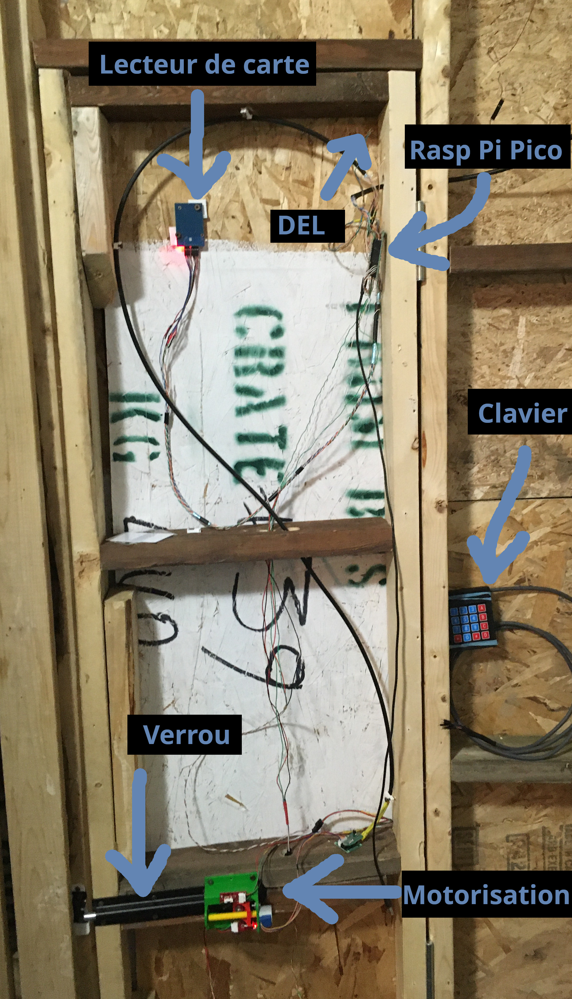

# 1.Introduction et présentation du projet
Ma résidence dispose - heureusement en cas d'urgence! - de deux portes d'accès.  Une d'entre elles mène vers un espace commun.  Elle ne pouvait pas être verrouillée.  L'autre mène à l'extérieur et se verrouille à clef.  Cependant, l'installation laisse à désirer; il est facile de forcer la serrure et d'entrer.  Je l'ai d'ailleurs fait à quelques reprises lorsque j'ai oublié ma clef!  Je voulais donc plus de sécurité et la possibilité de me « forcer » à ne pas oublier ma clef avant de partir.

## Présentation

Ce projet a été réalisé avec les composants électroniques que j'avais sous la main.  Bien sûr, il pourrait être meilleur, plus beau ou plus performant, mais ce sont les composants dans je disposais qui ont été assemblés et réunis afin de réaliser une opération utile à la sécurisation de ma résidence.

Sans surprise, la sécurité étant ce qui est visé lors de l'ajout d'un verrou, la sécurité doit aussi être visée lors de sa motorisation.  L'image ci-bas montre les composants AVANT la finition esthétique de la porte, ceux-ci étant installés dans la structure même de la porte.
 

 

## Fonctionnement
Ce système est basé sur un Raspberry Pi Pico qui gère l'activation d'un moteur par la lecture d'une carte magnétique.

 

 
 
Le système est appelé à gérer aussi la vérification d'un code d'accès introduit à l'aide d'un clavier à membrane.
  

  
Le système électronique meut la barre d'un verrou en acier, barre d'environ 1cm de diamètre.

-----
[Table des matières](README.md)   >>>  [Le nécessaire](02_MaterielNecessaire.md)
