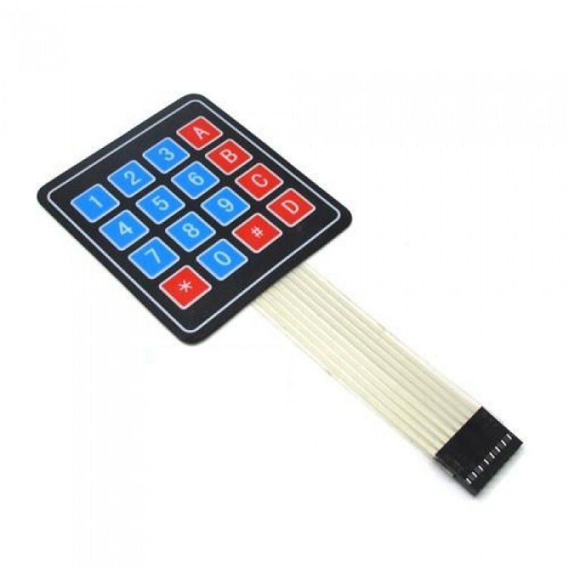

# 2. Liste du matériel, des bibliothèques et outils nécessaires

## Électrique
* Transformateur 120 VAC -> 5 VDC
* Plusieurs sections de fil (un câble réseau peut fournir tout cela, en 8 couleurs)
* Fils à connecteurs Dupont

## Électronique

<table width="100%" border="0">
<tr><td></td><td>Carte perforée aux dimensions appropriées ( au moins 10 par 24 trous espacés de 2.54 mm)</td></tr>
<tr><td></td><td>DEL trois couleurs (RVB) à anode commune</td></tr>
<tr><td></td><td> Deux interrupteurs de limite</td></tr>
<tr><td> </td><td>Module de pilote de moteur pas à pas ULN2003</td></tr>
<tr><td></td><td>Module RF5 RC522  (lecteur de cartes magnétiques)</td></tr>
<tr><td></td><td>Moteur pas à pas 28BVJ-48 (5 Volts)</td></tr>
<tr><td></td><td>Raspberry PI Pico</td></tr>
<tr><td></td><td>(option clavier à membrane) .. et oui ! ... le clavier à membrane</td></tr>
<tr><td></td><td>Connecteurs mâles et femelles pour circuit imprimé</td></tr>
</table>
  
  

## Impression 3d
<table width="100%" border="0">
<tr><td colspan="2">Imprimer les quatre composantes du support en PLA</td></tr>
	<tr><td>Une base (structure)</td><td></td></tr>
    <tr><td>Une vis sans fin (boulon)</td><td></td></tr>
    <tr><td>Un butoir</td><td></td></tr>
    <tr><td>Un curseur</td><td></td></tr>
</table>
 
<table width="100%" border="0">
<tr><td colspan="2">option: boîtier pour clavier en trois sections C'est ici le modèle gratuitementt par [kolec sur cults3d](https://cults3d.com/fr/mod%C3%A8le-3d/gadget/arduino-keypad-4x4-panel)
	</td></tr>
    <tr><td>Boîtier</td><td></td></tr>
    <tr><td>Dessus</td><td></td></tr>
    <tr><td>Couvercle</td><td></td></tr>
</td></tr>
</table>

## Informatique
* Éditeur et compilateur de code [Arduino IDE](https://www.arduino.cc/en/software)
* [Bibliothèques installées](../tree/main/src/bibliotheques): 
    * Stepper.h
    * SPI.h
    * MFRC522.h
    * (pour l'option clavier à membrane): Keypad.h
* Pilote de carte: Raspberry PI Pico -> utilisez votre interface Arduino-IDE pour cela

## Mécanique
* Verrou
* Vis à bois
<table>
<tr><td> </td><td>Verrou</td></tr>	<tr><td></td><td>Vis à bois</td></tr>
</table>

## Outils
<table>
	<tr><td></td><td>* Kit à souder  
    * fer à souder 
		* étain</td></tr>
<tr><td> </td><td>Perceuse & forêts à bois</td></tr>
<tr><td></td><td>Pistolet à colle chaude et colle chaude</td></tr>
<tr></td><td><td>Tous les petits outils habituels permettant de couper et dégainer les fils</td></tr>
<tr><td></td><td>Tourne-vis</td></tr>
</table>

---

[Introduction](01_Introduction_Presentation.md)  <<<  [Table des matières](README.md)   >>>    [Montage](03_Montage.md)
