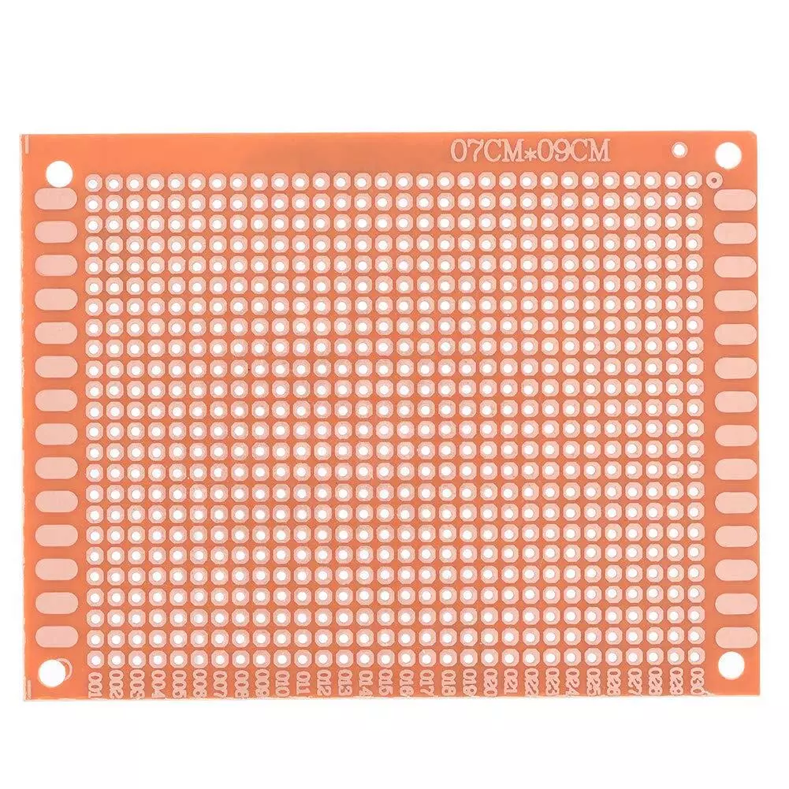

# 3. Le montage du circuit

## Le Raspberry PI pico sur une carte
Puisque vous serez appelé(e) à programmer ou corriger le programme à quelques reprises afin de répondre à vos besoin, je vous suggère de NE PAS souder le Pico directement sur la carte perforée.  Optez plutôt pour des broches mâles sur le Pico et des réceptacles femelles sur la carte perforée.
<table>
	<tr><td></td><td> ---> </td><td></td></tr>
	<tr><td></td><td> ---> </td><td></td></tr>
</table>

---

[Le nécessaire](02_MaterielNecessaire.md)  <<<  [Table des matières](README.md)   >>>    [Le câblage](04_Cablage.md)
