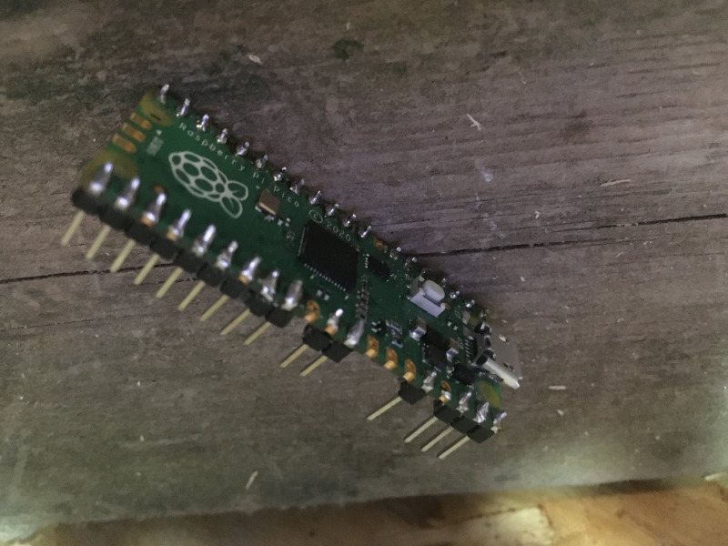
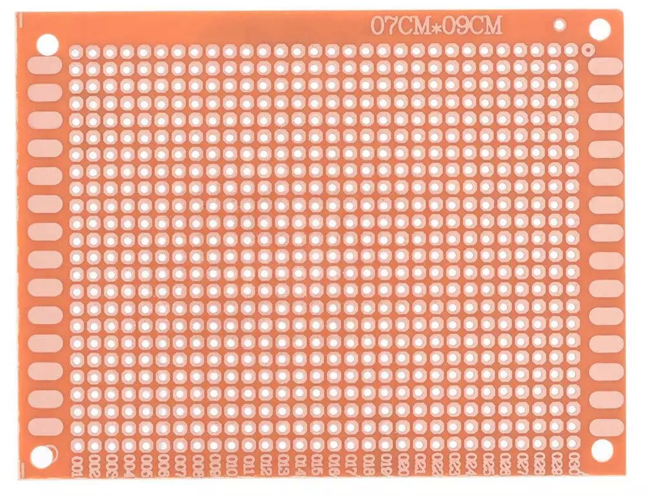

# 3a. Le montage du circuit

## Le Raspberry PI pico sur une carte
Puisque vous serez appelé(e) à programmer ou corriger le programme à quelques reprises afin de répondre à vos besoin, je vous suggère de NE PAS souder le Raspberry PI Pico (ci-bas nommé Pico) directement sur la carte perforée.  Optez plutôt pour des broches mâles sur le Pico et des réceptacles femelles sur la carte perforée.

Si vous souhaitez limiter la consommation de broches et de matériel en général, vous pouvez limiter vos soudures aux seuls éléments utilisés.
 

 
<table width="100%">
	<tr><td colspan="5">Soudez les broches mâles sur le Raspberry PI Pico</td></tr>
	<tr>
		<td></td>
		<td></td>
		<td></td>
		<td></td>
		<td></td>
	</tr>
	<tr><td colspan="5">Soudez les broches femelles sur la carte perforée.</td></tr>
	<tr>
		<td></td>
		<td></td>
		<td></td>
		<td></td>
		<td></td>
	</tr>
</table>

Voici comment seront utilisées les broches du Pico dans notre projet.
 

# 3b. Le montage mécanique
À ce point, il serait bon de considérer l'installation du verrou sur votre porte.
Assurez-vous qu'il coulisse librement et facilement, que le verouillage se fasse sans effort de même que le déverrouillage.
Gardez en tête que le petit moteur développe peu de puissance, que le tout est assemblée avec du plastique imprimé et  - donc - que toutes les composantes sont fragiles.
Le mouvement du verrou doit donc en tous points être facile et fluide.

Les principaux points à vérifier:
* insértion (et retrait) du verrou dans le logement de fermeture: alignement parfait, aisance de mouvement.

	<video width="320" height="240" controls>
      <source src=”../images/videos/deverrouillage.mp4” type="video/mp4">
    </video>

* le tenon du verrou ne doit pas s'engager dans les fentes d'immobilisation.

---

[Le nécessaire](02_MaterielNecessaire.md)  <<<  [Table des matières](README.md)   >>>    [Le câblage](04_Cablage.md)
