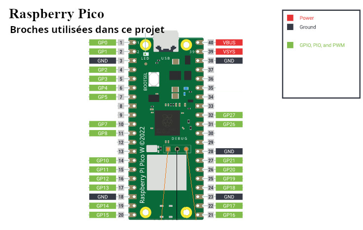

# 3. Le montage du circuit

## Le Raspberry PI pico sur une carte
Puisque vous serez appelé(e) à programmer ou corriger le programme à quelques reprises afin de répondre à vos besoin, je vous suggère de NE PAS souder le Raspberry PI Pico (ci-bas nommé Pico) directement sur la carte perforée.  Optez plutôt pour des broches mâles sur le Pico et des réceptacles femelles sur la carte perforée.

Si vous souhaitez limiter la consommation de broches et de matériel en général, vous pouvez limiter vos soudures aux seuls éléments utilisés.
 

 
<table>
	<tr><td colspan="5">Soudez les broches mâles sur le Raspberry PI Pico</td></tr>
	<tr><td></td>
		<td></td><td></td>
	<td></td>
	</tr>
	
	<tr><td colspan="5">Soudez les broches femelles sur la carte perforée.</td></tr>
	<tr><td></td><td></td><td></td>
	<td></td>
	</tr>
</table>

Voici comment seront utilisées les broches du Pico dans notre projet.
 

---

[Le nécessaire](02_MaterielNecessaire.md)  <<<  [Table des matières](README.md)   >>>    [Le câblage](04_Cablage.md)
