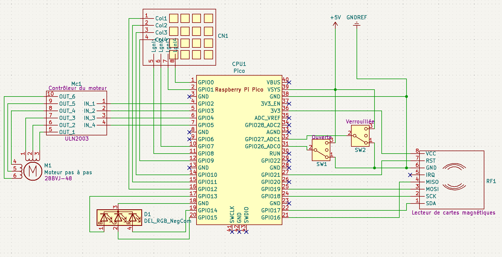

# 4. Le câblage

Prévoyez des câbles de bonne longueur pour chacun des éléments selon le positionnement de ceux-ci dans votre environnement.

De longueurs semblables, vous aurez: 
* Le contrôleur du moteur
* L'interrupteur de position « ouverte »
* L'interrupteur de position « verrouillée »

Quant aux autres, vous devrez composer avec l'environnement de votre installation.

Voici le schéma du câblage.
 

---

[Montage du circuit](03_Montage.md)  <<<  [Table des matières](README.md)   >>>    [L'assemblage](05_Assemblage.md)
