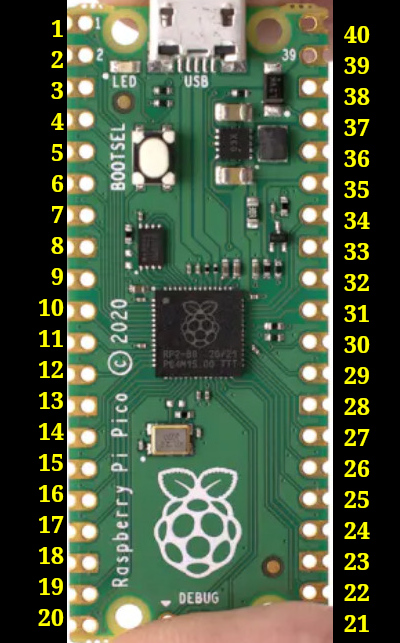

# 5. L'assemblage
---

Une carte spécialisée peut vous accommoder.

Je l'ai créée pour mes besoins, mais j'ai quelques copies disponibles.  Écrivez-moi à foi02@cartefoi.net

Sur une carte spécialisée ou une carte gérérique perforée, le montage sera le même.

La numérotation des broches de Rasp Pico est importante.  Lorsque vous regardez le micro-contrôleur en le plaçant verticalement, le connecteur USB vers le haut, les numéros vont comme suit.
La broche 1 est en haut à gauche.  En descendant sur le côté gauche, vous aurez ainsi les broches 1 à 20.
Puis, en remontant sur la droite, vous aurez les broches 21 à 40; la broche 40 étant l'alimentation 5 VCC du module et la 39 la mise à terre principale.
Normalement, les numéros 1, 2 et 39 sont imprimés sur la carte, comme le montre l'image suivante.

## Description des broches de RaspPi, selon l'utilité de ce projet.
Voir toutes les utilités possibles de RaspPico en [cliquant ici](https |//pico.pinout.xyz/)

| Broche1 | GPIO-00 | clavier 4x4 | fil blanc-brun |
| ----- | ----- | ------ | ----- | ------ |
| Broche2 | GPIO-01 | clavier 4x4 | fil brun |
| ----- | ----- | ------ | ----- | ------ |
| Broche3 | GND | ------ | ----- | ------ |
| ----- | ----- | ------ | ----- | ------ |
| Broche4 | GPIO-02 | Moteur | fil blanc-orange |
| ----- | ----- | ------ | ----- | ------ |
| Broche5 | GPIO-03 | Moteur | fil blanc-bleu |
| ----- | ----- | ------ | ----- | ------ |
| Broche6 | GPIO-04 | Moteur | fil blanc-vert |
| ----- | ----- | ------ | ----- | ------ |
| Broche7 | GPIO-05 | Moteur | fil blanc-brun |
| ----- | ----- | ------ | ----- | ------ |
| Broche8 | GND | ------ | ----- | ------ |
| ----- | ----- | ------ | ----- | ------ |
| Broche9 | ----- | ------ | ----- | ------ |
| ----- | ----- | ------ | ----- | ------ |
| Broche10 | GPIO-07 |  clavier 4x4 | blanc-orange |
| Broche11 | GPIO-08 |  clavier 4x4 | orange |
| Broche12 | GPIO-09 |  clavier 4x4 | blanc-bleu |
| Broche13 | GND | ------ | ----- | ------ |
| Broche14 | GPIO-10 |  clavier 4x4 | bleu |
| Broche15 | GPIO-11 |  clavier 4x4 | blanc-vert |
| Broche16 | ----- | ------ | ----- | ------ |
| ----- | ----- | ------ | ----- | ------ |
| Broche17 | GPIO-13 | DEL tricolor | rouge |
| ----- | ----- | ------ | ----- | ------ |
| Broche18 | GND | ------ | ----- | ------ |
| ----- | ----- | ------ | ----- | ------ |
| Broche19 | GPIO-14 | DEL tricolor | vert |
| ----- | ----- | ------ | ----- | ------ |
| Broche20 | GPIO-15 | DEL tricolor | bleu |
| ----- | ----- | ------ | ----- | ------ |
| Broche21 | SPI -> MISO | Carte identification | fil blanc-vert |
| ----- | ----- | ------ | ----- | ------ |
| Broche22 | SPI -> SDA | Carte identification  | fil blanc-bleu |
| ----- | ----- | ------ | ----- | ------ |
| Broche23 | GND | ------ | ----- | ------ |
| ----- | ----- | ------ | ----- | ------ |
| Broche24 | SPI -> CLOCK | Carte identification | fil blanc-brun |
| ----- | ----- | ------ | ----- | ------ |
| Broche25 | SPI -> MOSI | Carte identification | fil bleu |
| ----- | ----- | ------ | ----- | ------ |
| Broche26 | GPIO-20 | clavier 4x4 | vert |
| ----- | ----- | ------ | ----- | ------ |
| Broche27 | GPIO-21 (RST) | Carte identification | fil vert |
| ----- | ----- | ------ | ----- | ------ |
| Broche28 | GND | ------ | ----- | ------ |
| ----- | ----- | ------ | ----- | ------ |
| Broche29 | GPIO-22 | Bouton d'activation de la barrure, côté maison |
| ----- | ----- | ------ | ----- | ------ |
| Broche30 | GPIO-26 | Interrupteur fermé lorsque la porte est fermée |
| ----- | ----- | ------ | ----- | ------ |
| Broche31 | GPIO-27 | Interrupteur fermé lorsque la porte est ouverte |
| ----- | ----- | ------ | ----- | ------ |
| Broche32 | GND | ------ | ----- | ------ |
| ----- | ----- | ------ | ----- | ------ |
| Broche33 | | ------ | ----- | ------ |
| ----- | ----- | ------ | ----- | ------ |
| Broche34 | | ------ | ----- | ------ |
| ----- | ----- | ------ | ----- | ------ |
| Broche35 | | ------ | ----- | ------ |
| ----- | ----- | ------ | ----- | ------ |
| Broche36 | 3.3 VCC | Alimentation de divers composants en 3.3 volts |
| ----- | ----- | ------ | ----- | ------ |
| Broche37 | | ------ | ----- | ------ |
| ----- | ----- | ------ | ----- | ------ |
| Broche38 | GND | Mise à terre |
| ----- | ----- | ------ | ----- | ------ |
| Broche39 | 5VCC | Alimentation du Rasp Pico |
| ----- | ----- | ------ | ----- | ------ |
| Broche40 | | ------ | ----- | ------ |
| ----- | ----- | ------ | ----- | ------ |

[Câblage](04_Cablage.md)  <<<  [Table des matières](README.md)   >>>    [Impression 3d](06_Impression_3d.md)
