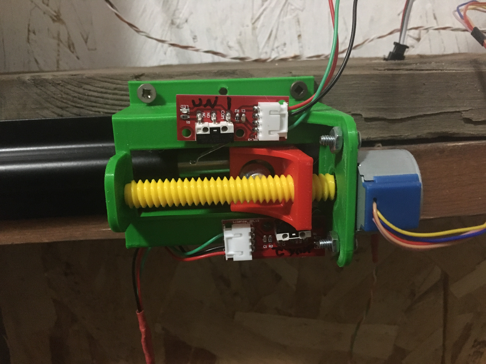

# Bienvenue!

Dans ce tutoriel, je compte vous montrer comment j'ai imprimé, assemblé et programmé la fermeture et l'ouverture d'une verrou ordinaire qu'on trouve en quincaillerie.

Oui, vous pouvez acheter des produits tout faits, mais vous n'aurez pas la satisfaction de la réalisation personnelle, satisfaction qui me pousse aujourd'hui à vous partager mes fichiers et informations.

Voici la pièce centrale du système: le support avec son moteur et ses pièces mobiles.
 Vue d`une installation fonctionnelle

#Table des matières

1. [Introduction et présentation](01_Introduction_Presentation.md)
2. [Liste du matériel, des bibliothèques et des outils nécessaires](02_MaterielNecessaire.md)
3. [Le montage sur carte](03_Montage.md)
4. [Le câblage](04_Cablage.md)
5. [L'assemblage](05_Assemblage.md)
6. [Impression du support spécialisé](06_Impression_3d.md)
7. [La programmation](07_Programmation.md)
8. [Premier test et ajustements](08_PremierTest.md)
9. Félicitations!
